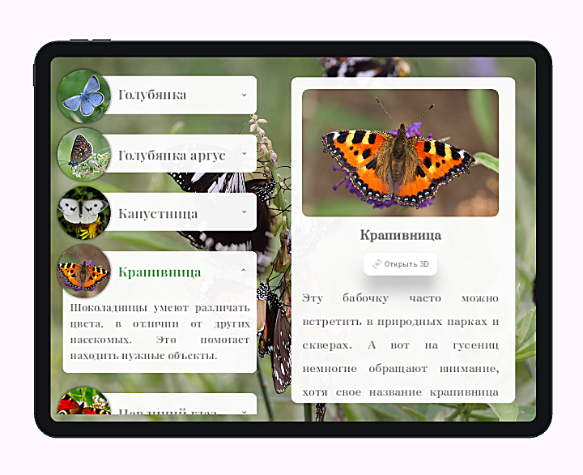
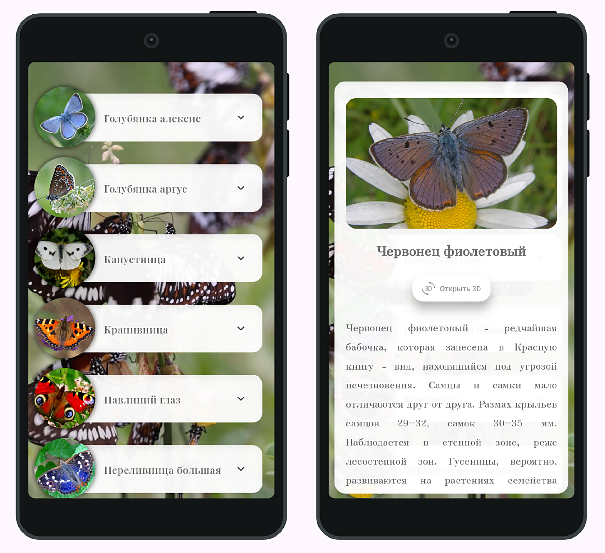
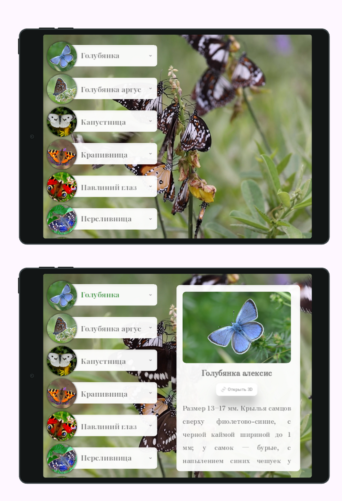

# 🦋 Butterfly Encyclopedia

A Flutter application with interactive 3D butterfly models, adaptive layout, and a dynamic video background.  
Built with a custom responsive system to support phones and tablets in portrait and landscape modes.

## ⚙️ Features

- Adaptive layout (phone / tablet / portrait / landscape)
- Dynamic video background
- Informative butterfly cards
- Detailed information screen
- Interactive 3D models (rotate and zoom)
- Custom responsive system (DeviceInfo + AppSizes)

## 📸 Demo / Preview






<table>
  <tr>
    <td></td>
    <td></td>
  </tr>
</table>





## 📦 Tech & Packages

- device_preview: ^1.2.0
- video_player: ^2.10.1
- model_viewer_plus: ^1.9.3

## 🛠️ Installation

```bash
git clone https://github.com/Ks577/butterfly-encyclopedia-flutter-app.git
cd butterfly-encyclopedia-flutter-app
flutter pub get
flutter run
